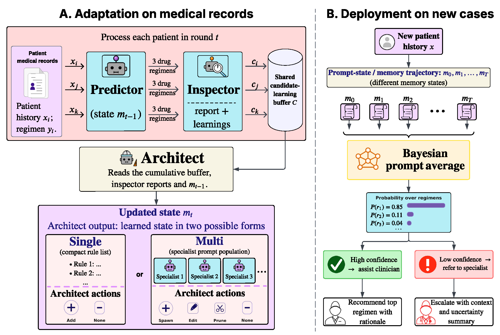

# Teaching LLMs to Recommend and Defer in Underrepresented Epilepsy Care

<p align="center">
<a href="https://arxiv.org/abs/2606.31036"></a>
</p>

---



Clinical LLM systems for epilepsy antiseizure medication (ASM) regimen
prediction. In the spirit of scientific reproducibility, we provide code to
reproduce the main results from the paper.

The repository has two systems:

- `manana` — self-learning prompt memory over clinical cases, plus Bayesian
  Prompt Averaging (BPA) for uncertainty-aware deferral.
- `consilium` — fixed expert-designed multi-agent reference system.

## Setup

```
uv sync
cp .env.example .env
```

Model calls use AWS Bedrock through `lib.llm.LLMClient`; configure AWS access
through the standard local environment.

## Layout

```
manana/                 self-learning system
  run.py                single / multi entry point
  single/ multi/        Predictor -> Inspector -> Buffer -> Architect loops
  bpa/                  Bayesian Prompt Averaging (uncertainty-aware deferral)
  ablations/            no-buffer / no-inspector / icl / rewrite ablations
  evaluate.py score.py  scoring against ground-truth regimens

consilium/              fixed expert-designed council
  agents/               epileptologist, pharmacologist, pediatrician, ...
  debate.py pipeline.py orchestration + debate
  single_agent/         single-prompt baselines
  analysis/             disagreement / conflict-detection utilities

baseline/               classical + EpiPick baselines
lib/                    LLM client, grader, regimen parser, IO
data_adapters/          Case JSONL loader
mimic/                  MIMIC-IV export pipeline
configs/                dataset configs
prompts/                shared prompt templates
assets/                 README figures
```

## Data

Manana uses Case JSONL — one prediction case per line.

Required fields: `pid` (or `patient_id`), `input` (or `clinical_context` /
`notes`), and `prescribed` (or `gt`). Optional: `visit_num`, `cohort`,
`output`, `stopped`, `split`.

```json
{"pid":"p001","visit_num":1,"input":"clinical note...","prescribed":["levetiracetam"],"stopped":[]}
```

Use `configs/jsonl_example.yaml` for the generic template and
`configs/mimic.yaml` for the MIMIC-IV export.

## Manana — self-learning

Run self-learning, then evaluate a saved run:

```
uv run python -m manana.run --config configs/jsonl_example.yaml --system single
uv run python -m manana.run --config configs/jsonl_example.yaml --system multi

uv run python -m manana.evaluate \
  --config configs/jsonl_example.yaml \
  --run-dir manana/single/outputs/<dataset>/<model>/<run_id> \
  --split test --round best
```

Ablations:

```
uv run python -m manana.ablations.run --config configs/jsonl_example.yaml --system single --ablation no-buffer
uv run python -m manana.ablations.run --config configs/jsonl_example.yaml --system multi --ablation no-inspector
uv run python -m manana.ablations.icl.run --config configs/jsonl_example.yaml
uv run python -m manana.ablations.rewrite.run --config configs/jsonl_example.yaml --system single
```

## Bayesian Prompt Averaging (BPA)

BPA turns a completed multi-agent Manana run into an uncertainty-aware,
deferral-capable predictor. It treats the learned prompt trajectory as an
ensemble — selecting the top rounds by validation top-3 rate, re-running each as
an ensemble member, and combining their ranked regimens into a weighted vote.
The winner's normalized vote mass is a per-case confidence used for selective
prediction: auto-handle the confident cases, defer the rest to a specialist.

```
uv run python -m manana.bpa.run \
  --config configs/jsonl_example.yaml \
  --run-dir manana/multi/outputs/<dataset>/<model>/<run_id> \
  --num 5 --weighting softmax --split test
```

Defaults match the paper: `--num 5`, `--weighting softmax`, `--tau 5`.

## MIMIC-IV

```
uv run python mimic/filter.py
uv run python mimic/gt.py
uv run python mimic/clean.py
uv run python mimic/export_cases.py

uv run python -m manana.run --config configs/mimic.yaml --system single
uv run python -m manana.run --config configs/mimic.yaml --system multi
```

`configs/mimic.yaml` uses 150 training and 60 validation cases, one admission
per patient. Full details in `mimic/README.md`.

## Consilium reference system

```
uv run python -m consilium.run --visit 1 --limit 5
uv run python -m consilium.single_agent.run --visit 1 --limit 5
uv run python -m consilium.single_agent.run --visit 1 --prompt all_agents_combined
uv run python -m consilium.ablation --visit 1 --limit 5
```

Optional analysis utilities live in `consilium/analysis/`.

## Citation

If you find this useful, please consider citing:

```bibtex
@article{rajesh2026teaching,
  title={Teaching LLMs to Recommend and Defer in Underrepresented Epilepsy Care},
  author={Rajesh, Shreyas and Sharma, Kartik and Monsoor, Tonmoy and Turali, Mehmet Yigit and Idro, Richard and Kayaga, Juliana and Sebunya, Robert and Namata, Tracy Tushabe and Pasqua, Jessica Nichole and Roychowdhury, Vwani and Mazumder, Rajarshi},
  journal={arXiv preprint arXiv:2606.31036},
  year={2026}
}
```
